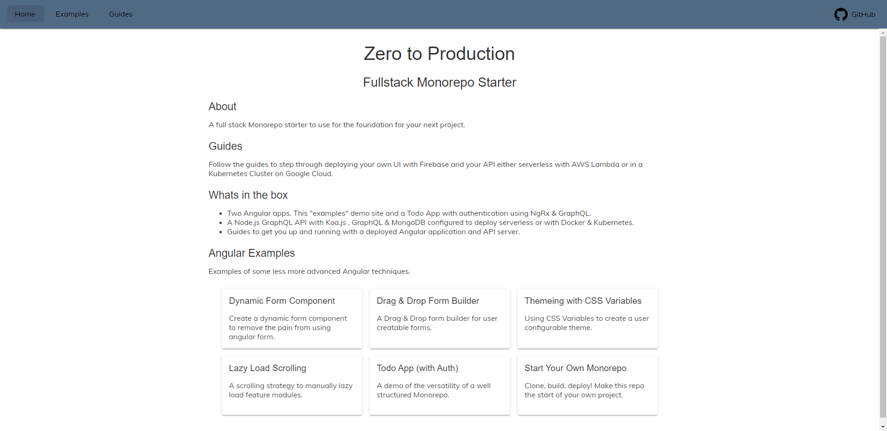
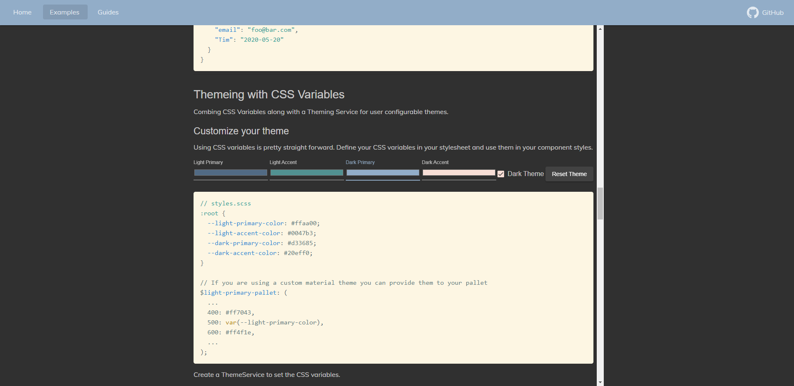
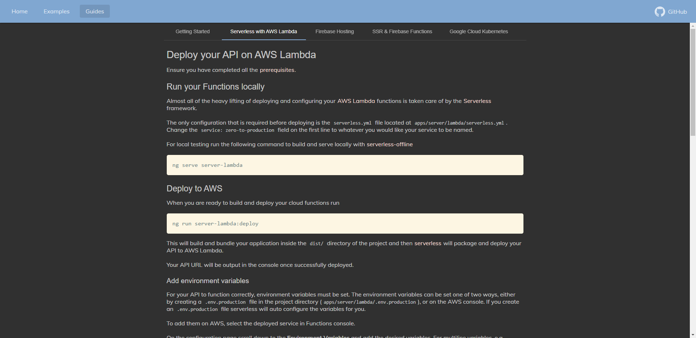

# Zero to Production - Monorepo Starter

### Clone... Build... Deploy...

A full stack Monorepo starter with Angular, NgRx, Koa.js, GraphQL & Kubernetes.

by Jonathon Adams  
Email: [jono.adams22@gmail.com](mailto:jono.adams22@gmail.com?subject=Zero%20to%20Production)

 

## Demo Site

Visit the [demo site]

A demos site with examples of advanced angular techniques and guides to deploy our project can be found at [zero-to-production.dev]

## Start Your Own

Follow the [getting started] guide to re-band, setup local development and make this monorepo the foundation of your own project.

## Deploy

Follow the following guides to deploy your Web App and API server.

- Deploy your serverless API on [AWS Lambda]
- Host your Angular App on [Firebase Hosting]
- Convert your Angular App to server side rendering with [Firebase Functions]
- Migrate your serverless API to Kubernetes on [Google Cloud Kubernetes]

## Contributing

Any and all contributions are welcome. If it's bug fixes, documentation improvements, security patches or even if you want to add a `React` app example, please submit a PR.

[demo site]: https://zero-to-production.dev
[zero-to-production.dev]: https://zero-to-production.dev
[getting started]: https://zero-to-production.dev/guides/getting-started
[aws lambda]: https://zero-to-production.dev/guides/aws-lambda
[firebase hosting]: https://zero-to-production.dev/guides/firebase-hosting
[firebase functions]: https://zero-to-production.dev/guides/ssr-firebase-functions
[start you own]: https://zero-to-production.dev/guides/getting-started
[google cloud kubernetes]: https://zero-to-production.dev/guides/google-cloud-k8s
